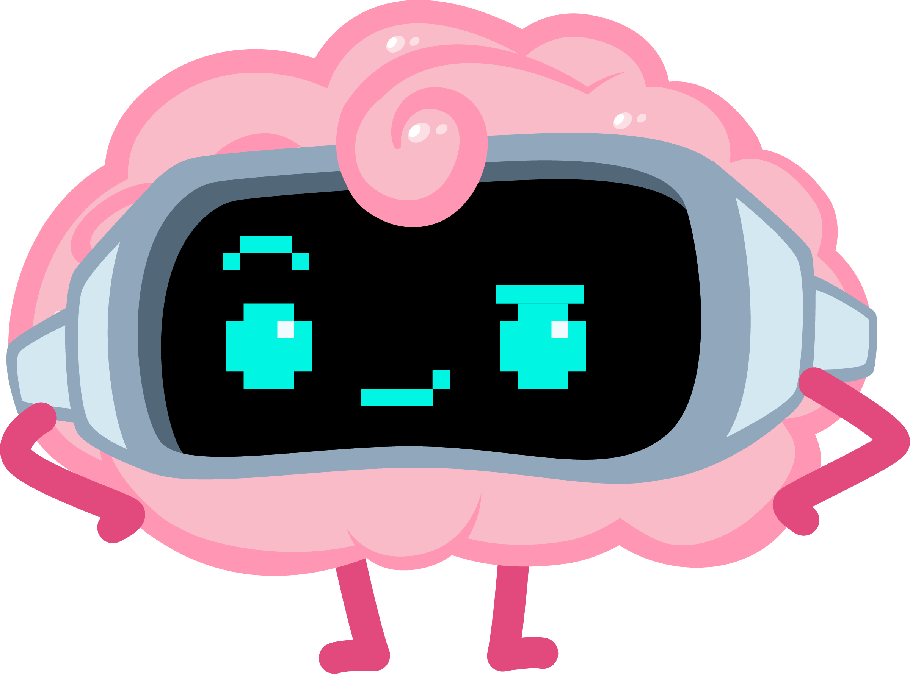

> ### Learning is like a road...  
> One that forks every couple of meters, where you never really arrive anywhere. That’s the beauty of it.
> 
> When I was working in games, people would ask me, “How do I learn to make games?” My answer was always the same: “Build a game, and learn the things you need to build that game.” 
> 
> I don’t think you learn by absorbing everything up front, you learn by moving, making, and getting stuck. 
>
> This repository contains the material I’ve used (and am still using) to learn AI. 
> 
> Do I know AI? Of course not, maybe I never will. But I’m having a wonderful time learning, building tools, talking about it, and figuring things out along the way.
>
> I hope you find useful content in here, and if you have suggestions, please let me know!

## Books

Here are the books I've read to make sense of AI/ML/DL. Some are more technical, some are more theoretical, and some are more ideas.

They are not in any particular order, although I tried to group them together based on what i think makes sense.

- [Deep Learning - A Visual Approach](https://www.glassner.com/portfolio/deep-learning-a-visual-approach/) Probably the best resource out there for building solid intuition about the many concepts surrounding deep learning. Andrew, the author, did a wonderful job illustrating these concepts, making it much easier to develop a real understanding of them.
- [Practical Deep Learning: A Python-Based Introduction](https://nostarch.com/practical-deep-learning-python) Probably the best resource for balancing deep learning concepts with a hands-on, Python-based approach. It’s much easier to follow if you actively implement the code, even if that just means typing out the examples from the book.
- [Dive Into Data Science: Use Python To Tackle Your Toughest Business Challenges](https://nostarch.com/dive-data-science) Not strictly about AI, although if you think about it, AI is deeply tied to data science. This book is great for understanding real-world scenarios and how to approach them using AI tools and Python. For me, the data preparation part was especially helpful.
- [Dive into Deep Learning](https://d2l.ai/index.html) An amazing free book that covers the fundamental concepts of deep learning, including how to build your own models from scratch. It leans toward the heavier side, but it comes with plenty of Jupyter notebooks you can run to test your understanding. I still can’t believe this resource is free.
- [Grokking Deep Learning](https://www.manning.com/books/grokking-deep-learning) When I read this book, I had a lot of “aha” moments. I’m not sure if it was the clarity of the explanations or the fact that I already had some background from other books, but either way, the examples and explanations are excellent. It strikes a good balance between theory, algorithms, and practical implementation.
- [Math for Deep Learning: A Practitioner's Guide to Mastering Neural Networks](https://nostarch.com/math-deep-learning) If you’re interested in how AI works under the hood, it ultimately comes down to a lot of math. This book does a great job explaining the essential mathematics behind implementing neural networks. It can feel overwhelming at times. The book is incredibly helpful for understanding how popular frameworks work, and how to better evaluate them for your use cases.
- [Why Machines Learn: The Elegant Math Behind Modern AI](https://anilananthaswamy.com/why-machines-learn) A fascinating mix of math and history that explores how we arrived at large language models (LLMs) today (2024). I recommend reading it after you’ve built some basic math foundations — you’ll find it much more helpful that way. 
- [Understanding Deep Learning](https://udlbook.github.io/udlbook/) Another amazing book, and it’s completely free! (But buy it if you can). This book puts special focus on the pedagogy of how to learn (and teach) deep learning. It also comes with interactive notebooks so you can try out the explanations yourself.
- [Practical Deep Learning for Coders with Fastai and PyTorch: AI Applications Without a PhD](https://course.fast.ai/Resources/book.html) This book comes with video lectures by [Jeremy Howard](https://x.com/jeremyphoward), the author and creator of FastAI. The goal is to give coders a head start in deep learning without diving too deep into the weeds. It still covers how to achieve a lot using the FastAI framework and PyTorch. Having the videos included made it especially cool, since I could both listen to and watch the author explain the concepts.
- [The Shape of Data: Geometry-Based Machine Learning and Data Analysis in R](https://nostarch.com/shapeofdata) When I got to this book, I already had a decent understanding of machine learning. Reading its geometric approach(spatial, geometrical, and visual rather than only statistical) gave me many moments where I smiled, things made sense even when framed through a different paradigm. I do wish the code examples weren’t in R, but I still managed to follow the concepts easily.
- [The Art of Machine Learning: A Hands-On Guide to Machine Learning with R](https://nostarch.com/art-machine-learning) I would recommend this book to anyone who is already familiar with R or wants to learn both R and machine learning together. It’s a quick read.
- [How AI Works: From Sorcery to Science](https://nostarch.com/how-ai-works) I recommend this book if you don’t want to code or dive into the technical details of AI, deep learning, or machine learning, but still want a high-level understanding of what it’s all about. It’s great for people in non-engineering or non-technical roles. The book gives clear explanations of how things work without getting lost in the weeds.
- [Superintelligence: Paths, Dangers, Strategies](https://global.oup.com/academic/product/superintelligence-9780198739838) This was the first non-technical book I read on AI. It was fascinating because it offered a glimpse into the broader implications of what we’re building. I don’t think everything predicted in the book will happen, but it presents great perspectives on how to mitigate potential risks.
- [The Myth of Artificial Intelligence](https://www.hup.harvard.edu/books/9780674278660) This book offers the perspective that artificial intelligence won’t become the powerful, dangerous new form of life many imagine. It provides solid arguments for why that is, presenting a view that is much less apocalyptic than what you usually hear.
- [The Coming Wave: Technology, Power, and the Twenty-first Century's Greatest Dilemma](https://the-coming-wave.com/) This book explores more catastrophic scenarios. Scenarios that, in my opinion, are entirely feasible. The book warns how the AI race could go wrong. It highlights not just the risks from machines themselves, but also the dangers of powerful tools falling into the wrong hands.
- [Ways of Being: Animals, Plants, Machines: The Search for a Planetary Intelligence](https://draw-down.com/products/animals-plants-machines-the-search-for-a-planetary-intelligence) This book explores not just artificial intelligence, but the many forms of intelligence that already exist alongside us on Earth. It’s a great source of inspiration and a reminder that intelligence comes in many shapes, most of which we don't understand.

## Courses & Tutorials

Not everyone learns the same way, sometimes I get too tired of just reading, and tutorials or courses in video form make me feel like I’m talking to someone.
If you prefer learning through videos or more interactive formats, I recommend taking a look at the following materials:

- [Getting Started with Deep Learning](https://learn.nvidia.com/courses/course?course_id=course-v1:DLI+S-FX-01+V1) A short introduction to deep learning, delivered by NVIDIA. If you just want a quick glimpse of the very basics before jumping into higher-level implementation, this is a solid place to start.
- [MIT Intro to Deep Learning](http://introtodeeplearning.com/) A free, intensive bootcamp taught by MIT researchers. Getting direct access to this content (updated every time they teach it) is amazing. (~10 hours of deep learning concepts, plus interesting guest lectures.)
- [Practical Deep Learning for Coders](https://course.fast.ai/) This is the acompanying course version of the FastAI book by [Jeremy Howard](https://x.com/jeremyphoward).
- [C++ Neural Network in a Weekend](https://www.jeremyong.com/cpp/machine-learning/2020/10/23/cpp-neural-network-in-a-weekend/) This might be too much if you’re just starting out, or if you’re not interested in low-level C++ implementations of neural networks. But I found it fascinating, and it made me appreciate how far modern frameworks and APIs have come.
- [🤗 Agents Course](https://huggingface.co/learn/agents-course/) Now that agentic AI is trending, Hugging Face launched this free course showcasing their `smolagents` framework. It also covers LlamaIndex and LangGraph. 

## Videos & Talks
- [Transformers (how LLMs work) explained visually](https://youtu.be/wjZofJX0v4M?si=AdcRXv8GtgIZTqkw) 3Blue1Brown’s beautifully and clearly explained video on how large language models (LLMs) work, including the transformer architecture and the concept of embeddings.
- [Visualizing transformers and attention | Talk for TNG Big Tech Day '24](https://youtu.be/KJtZARuO3JY?si=rWDYNLAteyWnhHju) Grant Sanderson's (3Blue1Brown) live explanation on how to think visually about transformers. This session is at the intersection of art and science.
- [Let's build GPT: from scratch, in code, spelled out.](https://www.youtube.com/watch?v=kCc8FmEb1nY&t=2095s) Andrej Karpathy's step-by-step guide on building GPT. I watched this video, but his entire channel is pretty good.

## Tools, Frameworks & Platforms

Understanding all the tools, frameworks, architectures, and ecosystems around AI can sometimes feel harder than understanding AI itself. Below are the ones I’ve explored and used enough to feel confident recommending.  
Of course, these won’t solve every use case, and I’m not listing every supporting technology you might need to build real-world AI systems, but it’s a start.

| Category         | Tools  |
|------------------|--------|
| Core Frameworks   |   - [**Hugging Face**](https://huggingface.co/): [Tool Description]   - [**Ollama**](https://ollama.com/): [Tool Description]   - [**LangChain**](https://www.langchain.com/): [Tool Description]   - [**LlamaIndex**](https://www.llamaindex.ai/): [Tool Description] |
| Developer Tools   |   - [**Gradio**](https://www.gradio.app/): [Tool Description]   - [**Google Colab**](https://colab.research.google.com/): [Tool Description]   - [**MongoDB**](https://mongodb.com/): [Tool Description] |
| Platforms / APIs  |   - [**Google AI for Developers**](https://ai.google.dev/): [Tool Description] |

## Python Libraries & Toolkits

| Category                     | Libraries                  |
|-------------------------------|-----------------------------|
| Data Science & Computation    | Pandas, NumPy, SciPy, scikit-learn |
| Plotting & Visualization      | Matplotlib, Seaborn         |
| Machine Learning / Deep Learning | TensorFlow, PyTorch       |
| Image Processing              | Pillow                      |
| Web Scraping                  | Beautiful Soup, Selenium    |

## Models

These are the model's I've used or explored.
- GPT (OpenAI)
- Claude (Anthropic)
- Gemini (Google DeepMind)
- LLaMA (Meta)
- DeepSeek

## Articles, Blogs & Interviews
- [John Carmack: Different path to AGI](https://dallasinnovates.com/exclusive-qa-john-carmacks-different-path-to-artificial-general-intelligence/)
- [The Illustrated Transformer](https://jalammar.github.io/illustrated-transformer/) & [The Narrated Illustrated Transformer](https://www.youtube.com/watch?v=-QH8fRhqFHM&list=WL&index=2)
- Deep Learning in a Nutshell [Part 1: Core Concepts](https://developer.nvidia.com/blog/deep-learning-nutshell-core-concepts/) | [Part 2:  History and Training](https://developer.nvidia.com/blog/deep-learning-nutshell-history-training/) | [Part 3: Sequence Learning](https://developer.nvidia.com/blog/deep-learning-nutshell-sequence-learning/) | [Part 4: Reinforcement Learning](https://developer.nvidia.com/blog/deep-learning-nutshell-reinforcement-learning/) | [Part 5: Reinforcement Learning](https://developer.nvidia.com/blog/deep-learning-nutshell-reinforcement-learning/)

## Papers

- [On the Biology of a Large Language Model](https://transformer-circuits.pub/2025/attribution-graphs/biology.html)
- [DreamFusion: Text-to-3D using 2D Diffusion](https://dreamfusion3d.github.io/)
- [GET3D: A Generative Model of High Quality 3D Textured Shapes Learned from Images](https://nv-tlabs.github.io/GET3D/)
- [NeRF: Representing Scenes as Neural Radiance Fields for View Synthesis](https://arxiv.org/abs/2003.08934)
- [Text2Room: Extracting Textured 3D Meshes from 2D Text-to-Image Models](https://lukashoel.github.io/text-to-room/)
- [Imagen: Text-to-Image Difussion Models](https://imagen.research.google/)
- [Gen-1](https://arxiv.org/abs/2302.03011)
- [Gender Shades: Intersectional Accuracy Disparities in Commercial Gender Classification](https://proceedings.mlr.press/v81/buolamwini18a/buolamwini18a.pdf)
- [Uncovering and Mitigating Algorithmic Bias through Learned Latent Structure](http://introtodeeplearning.com/AAAI_MitigatingAlgorithmicBias.pdf)

## Datasets
- [Kaggle Datasets](https://www.kaggle.com/datasets/)
- [CelebA](https://paperswithcode.com/dataset/celeba)
- [COCO](https://cocodataset.org/#home)
- [ImageNet](https://image-net.org/)
- [Cityscapes Dataset](https://www.cityscapes-dataset.com/)
- [ObjectNet](https://objectnet.dev/)
- [LAION 5B](https://laion.ai/blog/laion-5b/)
- [NAIRR Datasets](https://nairrpilot.org/pilotresources)
- [UCI Machine Learning Datasets](https://archive.ics.uci.edu/datasets)

## Ethics
* [Ethics of AI](https://ethics-of-ai.mooc.fi/)

## Notes & Highlights
- [Standard Notations for Deep Learning](https://cs230.stanford.edu/files/Notation.pdf)
- [Historical data on 'notable' Models by Epoch](https://epoch.ai/data/notable-ai-models)

## Reports
- [AI Index Report | Stanford](https://hai.stanford.edu/research/ai-index-report)
